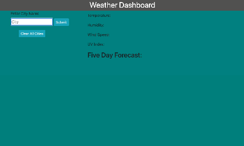

# **Weather-Dashboard**

## **Live Link**
https://reanderson89.github.io/weather-dashboard/

## **Contributors**
@reanderson89

## **Description**
This app uses an API from OpenWeather that will get the current weather and five day forecast in a city that the user wants to search for. The users searched cities are saved under the input field allowing them to easily access those cities and get new and up to date weather information each time they click on them. There is an added function that will allow the user to clear all of the saved cities if they would like. 

## **Technology Stack**

* HTML, CSS, Javascript, Jquery, Bootstrap

## **API Used**
*OpenWeather - (https://openweathermap.org/api)

## **Demo/Images**

## **Contact**

* #### **Name:** Robert Anderson (@reanderson89)
* #### **Email:** [reanderson89@gmail.com](reanderson89@gmail.com)

## **License**
MIT